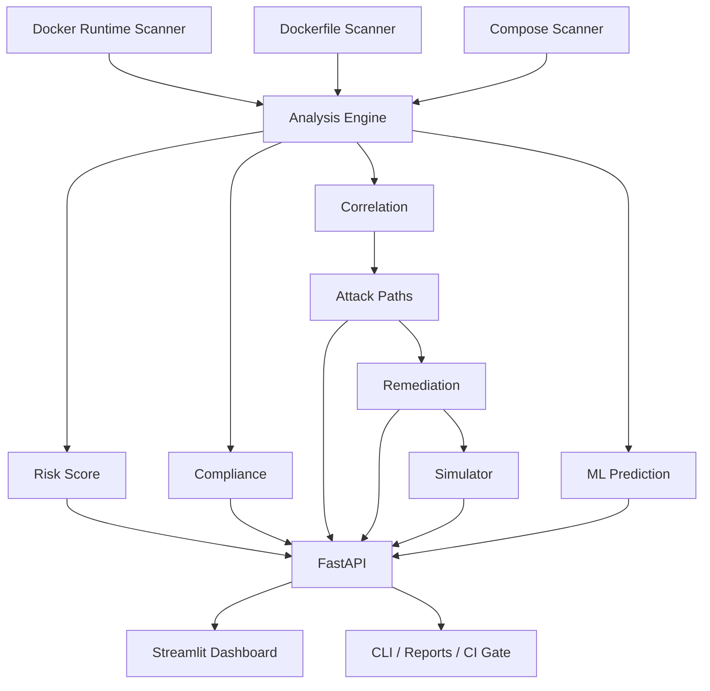

<div align="center">

# 🛡️ DockerShield

### Intelligent Docker Security, Compliance & Attack-Path Analysis Platform

*Find the weaknesses. Understand how they combine. Fix what matters first.*


</div>

---

## 📖 Overview

DockerShield is a Python-based Docker security assessment platform that identifies container security weaknesses, scores risk, checks compliance, correlates related findings, models attack paths, generates remediation guidance, and simulates remediation impact — through a **CLI**, a **REST API**, and a **web dashboard**.

It runs **locally, for free, and reproducibly** — no cloud services or commercial security APIs required.

Traditional scanners report issues one by one: *privileged container, exposed Docker socket, host networking, dangerous capabilities, missing limits…* Useful, but incomplete. DockerShield also answers:

> **How can these weaknesses combine to increase the impact of a container compromise?**

---

## ✨ Highlights

| | Feature | What it does |
|---|---|---|
| 🐳 | **Runtime scanning** | Inspects running containers (15 rules) |
| 📄 | **Dockerfile scanning** | Catches insecure build-time patterns (9 rules) |
| 🧩 | **Compose scanning** | Analyzes Compose services (13 rules) |
| 📊 | **Risk scoring** | Normalized 0–100 score with risk levels |
| ✅ | **Compliance** | 11 CIS-aligned hardening controls |
| 🔗 | **Correlation** | Groups findings into higher-level conditions |
| 🎯 | **Attack paths** | Models how weaknesses chain together |
| 🛠️ | **Remediation** | Prioritizes fixes that break attack paths |
| 🧪 | **What-if simulator** | Previews impact of fixes before you apply them |
| 📈 | **Baseline & regression** | Detects new/resolved findings over time |
| 🤖 | **ML prediction** | Optional XGBoost risk-level prediction |
| ⚡ | **FastAPI backend** | Programmatic access to every scan |
| 🖥️ | **Streamlit dashboard** | Security operations UI |
| 🚦 | **CI/CD security gate** | Fail builds when risk exceeds a threshold |

---

## 🏗️ Architecture



```text
Finding  →  Correlation  →  Attack Path  →  Remediation  →  Simulation
```

---

## 🔍 Rule Coverage

<details>
<summary><b>🐳 Runtime rules (DS001–DS010, DS023–DS027)</b></summary>

| Rule | Description | Severity |
|---|---|---|
| DS001 | Privileged container | 🔴 CRITICAL |
| DS002 | Container runs as root | 🟠 HIGH |
| DS003 | Docker socket exposed | 🔴 CRITICAL |
| DS004 | Sensitive host filesystem mount | 🟠 HIGH |
| DS005 | Host network namespace | 🟠 HIGH |
| DS006 | Host PID namespace | 🟠 HIGH |
| DS007 | Host IPC namespace | 🟠 HIGH |
| DS008 | Dangerous Linux capabilities | 🟠 HIGH |
| DS009 | Missing memory limit | 🟡 MEDIUM |
| DS010 | Missing CPU limit | 🟡 MEDIUM |
| DS023 | Writable root filesystem | 🟡 MEDIUM |
| DS024 | Missing no-new-privileges | 🟡 MEDIUM |
| DS025 | Host device exposed | 🟠 HIGH |
| DS026 | Capabilities not explicitly restricted | 🟡 MEDIUM |
| DS027 | Host UTS namespace | 🟠 HIGH |

</details>

<details>
<summary><b>📄 Dockerfile rules (DS011–DS014, DS028–DS032)</b></summary>

| Rule | Description | Severity |
|---|---|---|
| DS011 | No non-root user specified | 🟠 HIGH |
| DS012 | Unsafe `ADD` usage | 🟡 MEDIUM |
| DS013 | Possible secrets in environment config | 🔴 CRITICAL |
| DS014 | Remote content piped to shell | 🟠 HIGH |
| DS028 | Implicit `latest` image tag | 🟡 MEDIUM |
| DS029 | Remote URL used with `ADD` | 🟠 HIGH |
| DS030 | Package upgrade during image build | 🟡 MEDIUM |
| DS031 | Use of `sudo` | 🟡 MEDIUM |
| DS032 | Shell-form `CMD` / `ENTRYPOINT` | 🟢 LOW |

</details>

<details>
<summary><b>🧩 Compose rules (DS015–DS022, DS033–DS037)</b></summary>

| Rule | Description | Severity |
|---|---|---|
| DS015 | Privileged service | 🔴 CRITICAL |
| DS016 | Docker socket exposed | 🔴 CRITICAL |
| DS017 | Host networking | 🟠 HIGH |
| DS018 | Host PID namespace | 🟠 HIGH |
| DS019 | Host IPC namespace | 🟠 HIGH |
| DS020 | Dangerous Linux capabilities | 🟠 HIGH |
| DS021 | Missing memory limit | 🟡 MEDIUM |
| DS022 | Missing CPU limit | 🟡 MEDIUM |
| DS033 | Service explicitly runs as root | 🟠 HIGH |
| DS034 | Writable root filesystem | 🟡 MEDIUM |
| DS035 | Missing no-new-privileges | 🟡 MEDIUM |
| DS036 | Host device exposed | 🟠 HIGH |
| DS037 | Security profile weakened | 🟠 HIGH |

</details>

---

## 📊 Risk Scoring

Findings are converted into a normalized **0–100** score (capped at 100).

| Severity | Weight |
|---|---:|
| CRITICAL | 25 |
| HIGH | 15 |
| MEDIUM | 7 |
| LOW | 2 |

| Score | Level |
|---:|---|
| 0 | 🟢 SECURE |
| 1–29 | 🟡 LOW |
| 30–59 | 🟠 MEDIUM |
| 60–79 | 🔴 HIGH |
| 80–100 | 🟣 CRITICAL |

> The score is a prioritization aid, not a standardized industry risk rating.

---

## ✅ Compliance

DockerShield evaluates **11 CIS-aligned Docker hardening controls**, including privileged containers, host namespaces, sensitive mounts, Linux capabilities, resource limits, non-root users, safer Dockerfile instructions, secrets in image config, read-only root filesystem, privilege escalation, and security-profile weakening.

It reports total / passed / failed controls, compliance percentage, and the matched rules.

> These are *CIS-aligned* controls — not a verbatim implementation of the full CIS Docker Benchmark.

---

## 🎯 Correlation & Attack Paths

| Path | Chain | Rules |
|---|---|---|
| **PATH-001** Docker Daemon Access | Docker socket → daemon access → potential host impact | `DS016` |
| **PATH-002** Privileged Container | Privileged + dangerous capability → expanded privilege boundary | `DS015` + `DS020` |
| **PATH-003** Host Namespace Exposure | Host network + PID + IPC → reduced isolation | `DS017` + `DS018` + `DS019` |
| **PATH-004** Combined Host Impact | Privileged + host namespaces → expanded host interaction | `DS015` + `DS017` + `DS018` |

Attack paths are reported separately from findings, so you can tell **"What is wrong?"** apart from **"How can weaknesses combine?"**

---

## 🛠️ Remediation & Simulation

| ID | Action |
|---|---|
| REM-001 | Remove privileged mode |
| REM-002 | Remove Docker socket exposure |
| REM-003 | Disable host networking |
| REM-004 | Disable host PID namespace |
| REM-005 | Disable host IPC namespace |
| REM-006 | Remove unnecessary Linux capabilities |
| REM-007 | Add memory limit |
| REM-008 | Add CPU limit |

The **what-if simulator** recalculates the analysis as if selected remediations were applied — without touching your deployment — and compares finding count, risk score/level, compliance, correlations, and resolved vs. remaining attack paths.

```text
BEFORE  →  Risk 100 | CRITICAL | 8 findings | 4 attack paths
apply REM-001 (remove privileged mode)
AFTER   →  recalculated risk, findings, and attack paths
```

---

## 📈 Baseline & Regression

Save a baseline (findings, risk, compliance, correlations, attack paths, timestamp), then compare later scans to see **new**, **resolved**, and **unchanged** findings, plus risk/compliance change and regression status.

---

## 🤖 Machine-Learning Risk Prediction

An optional layer using **XGBoost + scikit-learn** on locally generated data. Scan results are converted into features (severity counts, privileged/root containers, Docker socket, capabilities, host namespaces, mounts, missing limits, unsafe Dockerfile patterns, possible secrets, remote shell patterns) and the model outputs a predicted risk level with class probabilities.

> ⚠️ **The ML dataset is synthetic.** Model confidence is *not* a real-world probability of compromise. The deterministic rule engine remains the primary analysis mechanism.

---

## 🚀 Quick Start

### Requirements

- Python 3.12+
- Docker Desktop / Docker Engine (running, for runtime scans)
- Git

### Install

```cmd
python -m venv .venv
.venv\Scripts\activate
python -m pip install --upgrade pip
python -m pip install docker pyyaml fastapi uvicorn streamlit requests pytest xgboost scikit-learn
```

> DockerShield intentionally does not use a `requirements.txt`; dependencies are installed directly (also in CI).

### Verify

```cmd
python dockershield.py doctor
python -m pytest -q
```

Expected: `35 passed`

---

## 💻 CLI

```cmd
python dockershield.py --help
```

| Command | Purpose |
|---|---|
| `python dockershield.py doctor` | Check Docker availability |
| `python dockershield.py discover` | Discover containers |
| `python dockershield.py scan` | Scan runtime containers |
| `python dockershield.py dockerfile test-data\Dockerfile` | Scan a Dockerfile |
| `python dockershield.py compose test-data\vulnerable\compose.yml` | Scan a Compose file |
| `python dockershield.py simulate test-data\vulnerable\compose.yml REM-001` | Simulate remediation |
| `python dockershield.py baseline test-data\secure\compose.yml` | Create a baseline |
| `python dockershield.py compare` | Compare against the baseline |
| `python dockershield.py report` | Generate `data/report.html` |

---

## ⚡ API

```cmd
uvicorn dockershield.api.app:app --host 127.0.0.1 --port 8001
```

- API: `http://127.0.0.1:8001`
- Health: `http://127.0.0.1:8001/health`
- Docs: `http://127.0.0.1:8001/docs`

Port `8001` is used because `8000` is often occupied by other local services.

| Method | Endpoint |
|---|---|
| GET | `/` |
| GET | `/health` |
| GET | `/containers` |
| POST | `/scan/runtime` |
| POST | `/scan/dockerfile` |
| POST | `/scan/compose` |
| POST | `/simulate` |
| GET | `/api/info` |

---

## 🖥️ Dashboard

```cmd
streamlit run dockershield\dashboard\app.py
```

Opens at `http://localhost:8501`. Start the FastAPI backend first.

| Section | Pages |
|---|---|
| **Operations** | Overview · Scan Center · Environment |
| **Analysis** | Findings · Risk Analysis · Compliance · Attack Paths · Correlations |
| **Response** | Remediation · Simulator · History · Reports |
| **Intelligence** | ML Analysis |

---

## 🚦 CI/CD Security Gate

Fail a pipeline when the risk score exceeds a threshold:

```cmd
python ci_security_gate.py test-data\secure\compose.yml 60
```

| Environment | File | Findings | Risk | Level | Gate |
|---|---|---:|---:|---|---|
| 🟢 Secure | `test-data/secure/compose.yml` | 0 | 0/100 | SECURE | ✅ PASS |
| 🟡 Moderate | `test-data/moderate/compose.yml` | 1 (`DS017`) | 15/100 | LOW | ✅ PASS |
| 🔴 Vulnerable | `test-data/vulnerable/compose.yml` | 10 | 100/100 | CRITICAL | ❌ FAIL |

GitHub Actions workflows (`tests.yml`, `security-scan.yml`) run automated tests, security scanning, and the CI gate.

---

## 📁 Project Structure

```text
Dockershield/
├── dockershield.py            # CLI entry point
├── ci_security_gate.py        # CI risk gate
├── dockershield/
│   ├── models.py  docker_client.py  runtime.py
│   ├── dockerfile.py  compose.py  report.py
│   ├── core/       scanner.py
│   ├── engine/     risk · compliance · correlation · attack_path
│   │               remediation · simulator · baseline
│   ├── ml/         features · dataset · trainer · predict
│   ├── api/        app.py
│   └── dashboard/  app.py · api_client · state · styles · analysis
│                   components/ (cards, charts) · pages/ (13 pages)
├── tests/                     # 35 automated tests
├── test-data/                 # secure · moderate · vulnerable demos
├── data/                      # baseline, report, ML dataset/model/metrics
└── .github/workflows/         # tests.yml · security-scan.yml
```

---

## 🧰 Tech Stack

| Area | Tools |
|---|---|
| Core | Python 3.12+, Docker Engine, Docker SDK for Python |
| Config scanning | PyYAML, Python standard library |
| API | FastAPI, Uvicorn |
| Dashboard | Streamlit, Requests |
| ML | XGBoost, scikit-learn |
| Testing | pytest |
| CI/CD | GitHub Actions |

---

## 🧭 Design Principles

- **Deterministic security first** — rules drive the analysis; ML is supplemental.
- **Local first** — no paid APIs, cloud platforms, or hosted AI.
- **Explainable findings** — every finding has a rule ID, severity, title, container, description, evidence, impact, and remediation.
- **Security context** — findings flow into correlations, attack paths, remediation, and simulation rather than a flat list.

---

## ⚠️ Limitations

DockerShield is an educational and research-oriented project, not a replacement for an enterprise container security platform.

- The ML dataset is synthetic; confidence is not real-world exploit probability.
- Dockerfile secret detection is heuristic.
- Findings do not prove exploitation is possible; attack paths are modeled relationships.
- Compliance controls are CIS-aligned, not a full CIS Docker Benchmark reproduction.
- Image vulnerability scanning and SBOM generation are out of scope for the current rule engine.
- Runtime scanning requires access to the local Docker Engine.

**Out of scope:** Kubernetes security, cloud security, image vulnerability databases, identity platforms, network intrusion detection.

---

## 🗺️ Roadmap

- [ ] Expanded runtime rule coverage
- [ ] More attack-path relationships
- [ ] Additional remediation actions
- [ ] Improved historical trend analysis
- [ ] More realistic ML datasets
- [ ] Optional vulnerability scanner & SBOM integration
- [ ] SARIF reporting
- [ ] More CI/CD integrations and compliance mappings
- [ ] Customizable reports

---

## ✅ Project Status

| Capability | Status |
|---|:---:|
| Runtime / Dockerfile / Compose scanning | ✅ |
| Risk scoring & compliance | ✅ |
| Correlation & attack paths | ✅ |
| Remediation & what-if simulation | ✅ |
| Baseline analysis | ✅ |
| ML risk prediction | ✅ |
| FastAPI backend & Streamlit dashboard | ✅ |
| HTML reporting | ✅ |
| CI security gate & GitHub Actions | ✅ |
| Automated tests (35 passed) | ✅ |

---

## 📜 License & Responsible Use

Intended for **educational, research, and defensive security** purposes. Use DockerShield only against Docker environments you are authorized to assess.

---

<div align="center">

**🛡️ DockerShield** — Intelligent Docker Security, Compliance & Attack-Path Analysis Platform

Built with Python, Docker, FastAPI, Streamlit, XGBoost, and open-source security engineering.

</div>
